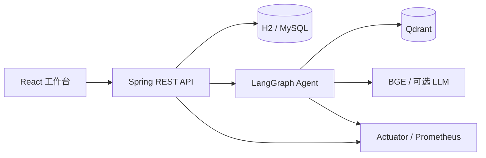
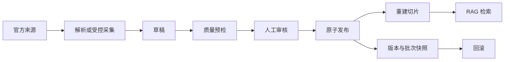

# 项目架构

## 1. 项目定位

计算机考研助手用于整理可追溯的院校与招生资料，并帮助用户完成：

`建立画像 -> 筛选院校 -> 形成候选 -> 对比证据 -> AI 追问 -> 导出方案`

系统同时提供数据管理、资料解析、受控网页采集、人工审核、批次发布、版本回滚和质量评估。核心原则是：

- 缺失优于虚构，无法核验的数字保持为空。
- 用户结论必须能回到来源 URL、资料原文或检索片段。
- 待审核资料不进入用户侧检索和回答。
- Agent 可以规划、调用工具和恢复任务，但写库前必须经过人工审批。

## 2. 技术结构

| 层 | 实现 |
| --- | --- |
| 用户端与管理端 | React、TypeScript、Vite、Vitest、Playwright |
| 业务后端 | Java 17、Spring Boot 3、JdbcTemplate、Bean Validation |
| 智能体 | Python、FastAPI、LangGraph、LangChain 工具协议 |
| 检索 | BGE Embedding、Qdrant、BM25、RRF、特征重排 |
| 数据库 | H2 开发库、MySQL 生产库、Flyway V1-V15 |
| 可观测性 | 结构化日志、W3C Trace Context、OpenTelemetry、Prometheus、Alertmanager |
| 部署 | Docker Compose、Nginx、Blackbox Exporter、GitHub Actions |



开发端口：前端 `5173`、Spring `18888`、Agent `18889`。浏览器只访问前端代理和 Spring，不直接持有 Agent 内部令牌。

## 3. 业务模块

### 用户端

- 院校检索：按省份、层次、408、专业和数据状态筛选。
- 择校决策：画像、推荐、候选清单、横向对比和导出。
- 证据详情：招生计划、考试科目、复试线、录取结果、复试规则和来源。
- 资料问答：按学校、年份和资料类型检索，返回引用与执行状态。

### 管理端

- 维护学校、学院、专业和结构化招生数据。
- 管理来源、原文、切片、版本和覆盖任务。
- 解析 PDF/文本，按文件 SHA-256 复用任务。
- 从已登记精确官方 URL 发起受控采集，不接受任意 URL。
- 对官网正文变化进行人工复核。
- 对多份资料执行原子发布和整批回滚。
- 对拟录取名单执行匿名化、专业映射预览、草稿和管理员发布。
- 运行索引同步、评估、知识审计、规划和证据工作流。

## 4. Agent 与 RAG

### LangGraph 能力

- `StateGraph`：表达查询、规划、采集、验证、审核、发布和评估状态。
- `ToolNode`：在知识检索、覆盖分析和运维工具之间路由。
- Checkpointer：使用 SQLite 保存线程状态，支持中断后恢复。
- Human-in-the-loop：候选证据在写库前中断，管理员批准或驳回后继续。
- `Send`：按学校或候选资料并行分发采集与验证节点，再由 reducer 汇总。
- Specialist subgraph：分别验证来源、院校、年份、资料类型、长度和内容质量。
- 持久化任务：支持进度、取消、超时、重试、回放、trace 和诊断查询。

该 Agent 不只是模型 API 包装。无外部模型时，规划、检索、门禁、HITL 和发布流程仍可执行；LLM 规划器是显式对照。系统公开不含密钥的配置就绪度，记录模型原始目标和规则拦截目标；未配置时结果标记为 `SKIPPED`，门禁拒绝把空实验当成通过。

### RAG 链路

1. 文档解析：PDF、文本、Markdown、CSV 和受控网页正文。
2. 切片：按窗口与重叠生成 `document_chunk`，保留学校、年份和资料类型元数据。
3. Embedding：本地 `bge-small-zh-v1.5`。
4. 多路召回：Qdrant 向量检索与 BM25 关键词检索。
5. 融合与重排：RRF、相邻上下文扩展、院校/年份/类型特征重排。
6. 生成：默认使用有依据的抽取式回答，可选外部 LLM；答案返回真实引用。

评估覆盖 Recall@1/5、MRR@5、重排增益、引用编号、来源 URL、答案支持、学校范围、安全边界和任务完成率。隔离重排基准固定同一数据集和语料，比较 `off / feature / cross-encoder` 的质量与延迟，并保存数据、语料、模型权重和结果哈希。`quality-gate-v3` 同时约束引用来源、LLM 规划 Exact Match/召回、Usage、失败案例和越界提议；费用支持有真实单价的 `METERED` 和无公开单价的 `UNMETERED`，后者保留 Token 但不生成虚假金额。困难集和阈值位于 `agent-service/evals/` 与 `app/quality_gate.py`。

## 5. 数据与发布链路



受控网页采集限制 HTTP(S) 80/443、精确文章路径、同站点重定向、响应体积和超时；每次请求及重定向前执行 DNS 与公网地址检查。首次正文只建立基线，相同哈希只增加复用次数，正文变化或恢复为历史版本都会生成待复核事件。变化事件不会自动改资料、发布或重建索引。

发布批次最多包含 100 份资料。学校、年份、资料类型、HTTPS 官方来源、可信度和正文必须全部通过；任一失败时批次、版本、资料和切片均不写入。发布后存在新修改时，整批回滚会被拒绝，避免覆盖后续工作。

拟录取名单不复用普通结构化表单。原始文件只在本机处理，候选人以加盐 SHA-256 键写入 `admission_result_candidate`；姓名、考号和联系方式禁止进入输出批次。导入先创建 `admission_result_import_batch` 草稿，预览按学校、学院、专业代码、学位类型、学习方式和计划口径分组。只有官方已发布拟录取名单、唯一专业映射和无冲突录取结果的普通计划分组可由管理员发布；分数不完整时只发布人数，分数指标保持为空。

## 6. 数据模型

完整字段以 `backend/src/main/resources/schema-h2.sql` 和 Flyway 迁移为准。文档只维护职责，不复制整份建表 SQL。

| 领域 | 核心表 |
| --- | --- |
| 院校 | `school`、`college`、`major` |
| 招生 | `admission_plan`、`exam_subject`、`national_score_line`、`school_score_line`、`score_line`、`admission_result`、`admission_result_import_batch`、`admission_result_candidate` |
| 复试 | `retest_rule`、`reference_book`、`adjustment_info` |
| 来源与知识库 | `document_source`、`source_document`、`document_chunk` |
| 版本与发布 | `source_document_version`、`document_publication_batch`、`document_publication_batch_item` |
| 导入与采集 | `document_parse_task`、`web_capture_task`、`web_capture_change` |
| 运营 | `data_collection_task`、`data_collection_target`、`data_collection_task_history` |
| 身份与审计 | `admin_user`、`admin_session`、`data_change_log` |
| 其他 | `ai_conversation`、`catalog_import_batch` |

Flyway 迁移：

| 版本 | 内容 |
| --- | --- |
| V1 | 业务基线 |
| V2 | 资料版本 |
| V3 | 管理端 RBAC |
| V4 | 持久化会话 |
| V5 | 文件解析任务 |
| V6 | 受控网页采集 |
| V7 | 原子发布批次 |
| V8 | 官网正文变化事件 |
| V9 | 官网定时监测计划与数据库租约 |
| V10 | 重点院校已核验资料与结构化数据 |
| V11 | 聚合研究方向扩展为长文本 |
| V12 | 国家线与自主划线院校标记 |
| V13 | 独立学校基本线及来源哈希 |
| V14 | 拟录取名单草稿与匿名候选人 |

## 7. API 分组

统一响应：`{ code, message, data }`。参数错误返回 `400`，未登录返回 `401`，越权返回 `403`，未处理异常返回 `500` 并记录关联 ID。

| 分组 | 路径 |
| --- | --- |
| 健康与指标 | `/api/health`、`/actuator/health/*`、`/actuator/prometheus` |
| 鉴权 | `/api/auth/login`、`/logout`、`/password` |
| 院校与结构化数据 | `/api/schools`、`/colleges`、`/majors`、`/admission-*`、`/exam-subjects`、`/score-lines`、`/retest-rules` |
| 来源与资料 | `/api/sources`、`/api/source-documents` |
| 文件与网页导入 | `/api/source-documents/parse*`、`/web-captures*`、`/web-capture-schedules*` |
| 变化与发布 | `/web-capture-changes*`、`/publication-batches*` |
| 决策 | `/api/compare`、`/api/recommendations` |
| AI 问答 | `/api/ai/chat`、`/api/ai/conversations` |
| Agent 运维 | `/api/ai/agent/operations/*` |
| 数据覆盖 | `/api/data-coverage`、`/tasks*` |
| 408 目录 | `/api/catalog-imports/408*` |
| 学校基本线 | `/api/catalog-imports/self-score-lines*` |
| 拟录取名单 | `/api/admission-result-imports*` |

管理写接口必须携带 `Authorization: Bearer <token>`。角色分为 `ADMIN`、`DATA_EDITOR` 和 `AUDITOR`；内部 Agent 发布另用随机服务令牌并锁定学校、URL、资料类型和年份范围。

## 8. 配置与部署

- 配置由 `application.yml`、`application-mysql.yml` 和环境变量提供，密钥不入库。
- 开发使用 H2 文件库；MySQL 环境由 Flyway 自动迁移。
- 官网定时监测默认关闭；启用后只处理已登记精确文章 URL，数据库租约负责多实例互斥，结果仍需人工复核和发布。
- `deploy/compose.yml` 编排 MySQL、Backend、Agent、索引同步、Frontend、Blackbox、Prometheus 和 Alertmanager。
- 业务库、Agent 数据、Prometheus 与 Alertmanager 使用独立数据卷，本地 BGE 模型只读挂载。
- 告警覆盖服务不可用、5xx、空索引、Agent 完成率、工具成功率、JVM 堆压力和官网变化复核超时。

## 9. 目录职责

```text
cs-kaoyan-ai/
├─ frontend/             React 用户端与管理端
├─ backend/              Spring API、H2 schema、Flyway 迁移
├─ agent-service/        LangGraph、RAG、评估与任务存储
├─ database/             可导入数据与数据库辅助 SQL
├─ deploy/               Compose、Nginx、Prometheus、Alertmanager
├─ scripts/              启动、迁移、备份、故障演练和采集脚本
├─ docs/                 架构、路线图、验证说明
└─ backups/h2/           已验证的本地 H2 备份清单
```
